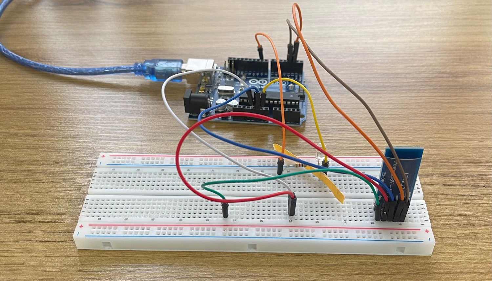

# HC-05 Bluetooth PWM LED Control

This project uses an HC-05 Bluetooth module to control an LED brightness via PWM using an Arduino Uno.

## Hardware Setup

1. Connect **VCC** and **GND** pins of the HC-05 module to **5V** and **GND** of the Arduino Uno.
2. Connect **RX** and **TX** pins of the HC-05 to Arduino pins **3** and **2** respectively.
3. Connect the **GND** pin of the LED to **GND** of the Arduino.
4. Connect the **+** pin of the LED to a resistor, and connect the other side of the resistor to **pin 9** of the Arduino  
   (make sure to select a pin that supports PWM).

## Entering AT Mode (Configuration Mode)

To configure the HC-05, you must enter AT mode.

1. Connect **EN** and **VCC** pins of the Bluetooth module to Arduino **5V**, and **GND** to Arduino **GND**.
2. Upload an empty sketch to the Arduino.
3. Connect HC-05 **RX** and **TX** to Arduino **RX** and **TX** (RX→RX, TX→TX).
4. Unplug the Arduino USB cable.
5. Press and hold the push button on the HC-05 module, then reconnect the USB cable.
6. Release the button. The HC-05 LED should blink slowly (AT mode).
7. Open Serial Monitor:
   - Line ending: **Both NL & CR**
   - Baud rate: **38400**
8. Type `AT` and you should receive `OK`.

If you get errors, check wiring or try again.

## Recommended AT Commands

Reset to factory settings:

```
AT+RST
```

Restore default configuration:

```
AT+ORGL
```

Set class:

```
AT+CLASS=0
```

Set role (Master = 1, Slave = 0):

```
AT+ROLE=0
```

Set device name:

```
AT+NAME=YourName
```

Check device name:

```
AT+NAME?
```

> Note: Master mode is useful when two MCUs need to connect directly.

## Data Mode (Normal Operation)

1. Download a Bluetooth terminal app on your phone and connect to the HC-05.
2. Disconnect **VCC**, then disconnect **EN**, and reconnect **VCC** only.  
   The LED should blink faster (data mode).
3. Upload the project code to the Arduino.
4. Send commands from the app:
   - `ON` → Turn LED on
   - `OFF` → Turn LED off
   - A number between `0` and `255` → Control LED brightness using PWM

You can see received messages in the Serial Monitor (baud rate: **115200**).

## Notes

1. Although most tutorials suggest using **9600 baud** for data mode, this module worked correctly with **38400 baud** in both AT mode and data mode for me.

2. Initially, the device was not visible in the phone's Bluetooth settings. After performing a factory reset and restoring the default configuration, the device became discoverable within a few minutes.


